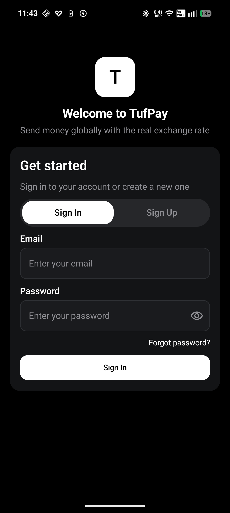
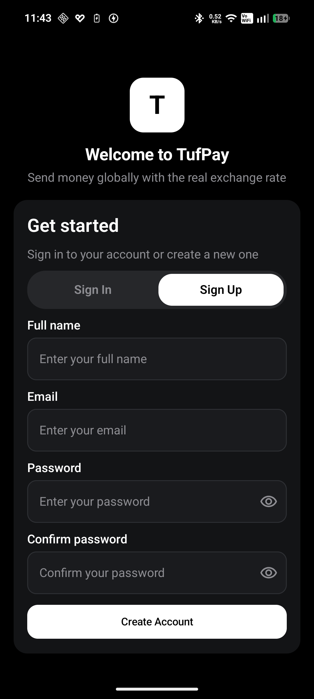
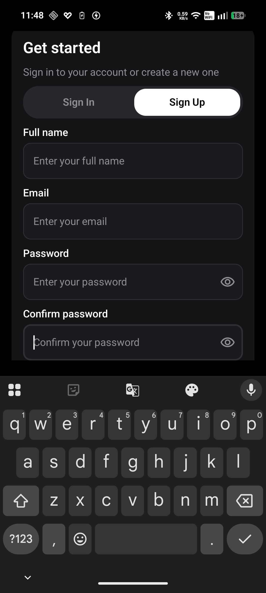
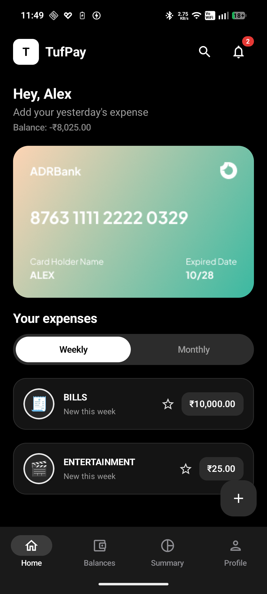
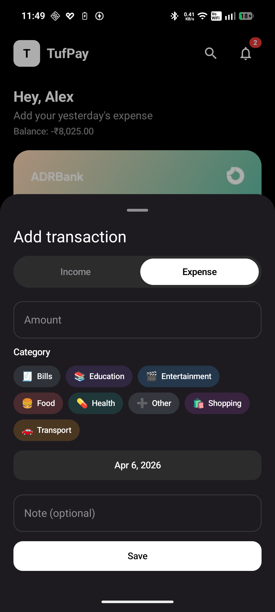
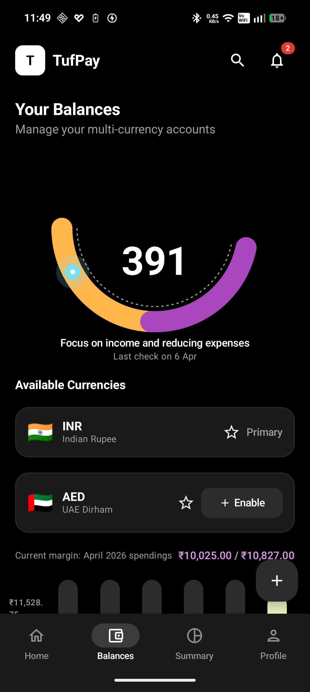
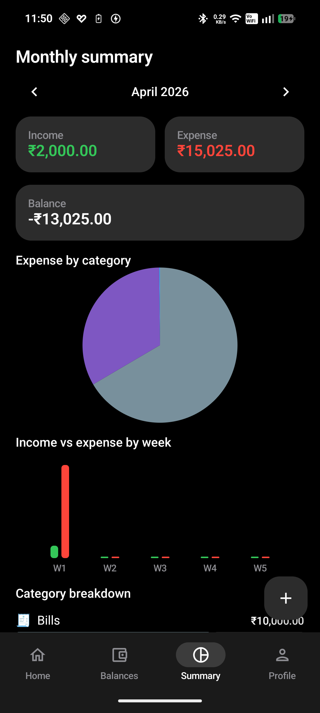
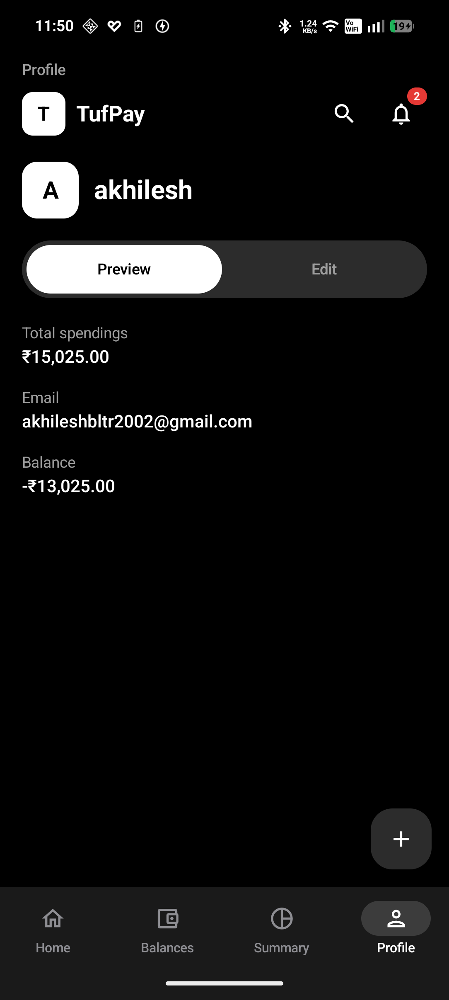
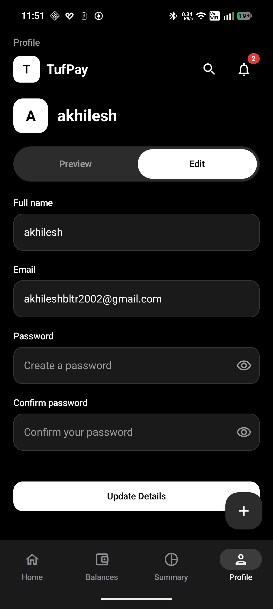

# TufPay (Finance Manager)

Android expense and finance tracker with **Jetpack Compose**, **Material 3**, and **offline-first** storage. Branding in the app appears as **TufPay**.

---

## Tech stack

| Layer | Technology |
|--------|------------|
| Language | Kotlin **2.0** |
| UI | **Jetpack Compose**, **Material 3** (Compose BOM **2024.12.01**) |
| Architecture | MVVM, single-activity, clean-style layers (presentation → domain → data) |
| Async | **Kotlin Coroutines**, `StateFlow` / `SharedFlow` |
| DI | **Dagger Hilt** |
| Local DB | **Room** (entities, DAOs, migrations via **KSP**) |
| Preferences | **DataStore** (theme mode, etc.) |
| Navigation | **Navigation Compose** (typed routes, bottom bar) |
| Backend (auth / sync) | **Firebase Authentication**, **Firebase Realtime Database** (as wired in the project) |
| Build | **Gradle** with **version catalog** (`gradle/libs.versions.toml`), **AGP 8.7.2** |
| Min / target SDK | **minSdk 26**, **compileSdk / targetSdk 34** |
| Java toolchain | **JDK 17** |

---

## Features (overview)

- **Authentication:** Email/password sign-in and sign-up (`AuthScreen`), session handling.
- **Home:** Greeting, balance summary, card visual, expense rows with weekly/monthly toggle.
- **Balances:** Multi-currency style UI, health gauge, weekly spending bars.
- **Summary:** Month navigation, income/expense cards, pie and bar charts, category breakdown.
- **Profile:** Preview vs Edit, profile fields, dark/light theme toggle, logout, clear data.
- **Add transaction:** Bottom sheet with income/expense toggle, categories, date, note, validation.

---

## How to run the project

### Prerequisites

- **JDK 17**
- **Android Studio** (latest stable recommended)
- An **Android emulator** (API 26+) or a **physical device** with USB debugging

### Steps

1. **Clone** this repository and open the **project root** in Android Studio.
2. **Place Firebase config:** add your `google-services.json` under `app/` (Firebase console → Project settings → Your apps). The project uses the Google Services Gradle plugin; without a valid file, sync may fail or Firebase features will not work.
3. **Sync Gradle** (File → Sync Project with Gradle Files). Dependencies are declared via `gradle/libs.versions.toml`.
4. **Run** the app:
   - Click **Run** ▶️ with the `app` configuration, or
   - From a terminal at the project root:

```bash
./gradlew :app:installDebug
```

5. **Build a debug APK** (optional):

```bash
./gradlew :app:assembleDebug
```

Output: `app/build/outputs/apk/debug/app-debug.apk`

### Release build (optional)

Configure signing in `app/build.gradle.kts`, then:

```bash
./gradlew :app:assembleRelease
```

Output: `app/build/outputs/apk/release/app-release.apk`

---

## Screenshots

Dark theme captures below; paths point to assets in the repo (`app/src/main/res/drawable/`).

### Sign In



### Home



### Sign Up / Get started (with keyboard)



### Authentication (Sign Up flow)



### Add transaction



### Balances



### Monthly summary



### Profile (Preview)



### Profile (Edit)



---

## Architecture

Clean-ish layers with MVVM in presentation:

```
┌─────────────────────────────────────────────────────────┐
│                     Presentation                         │
│  Composables  →  ViewModel  →  UseCase                   │
└──────────────────────────┬──────────────────────────────┘
                           │
┌──────────────────────────▼──────────────────────────────┐
│                       Domain                             │
│  Models · Repository interfaces · Use cases              │
└──────────────────────────┬──────────────────────────────┘
                           │
┌──────────────────────────▼──────────────────────────────┐
│                        Data                            │
│  Room (DAO/Entity) · Mappers · RepositoryImpl          │
│  DataStore · Firebase (where applicable)               │
└─────────────────────────────────────────────────────────┘
```

---

## Technical notes

- **compileSdk / targetSdk:** 34. `androidx.core:core-ktx` is aligned with API 34 for this project.
- **Charts:** Custom `Canvas` composables (e.g. gauge, pie, bars).
- **ProGuard:** Rules for Room and Hilt live in `app/proguard-rules.pro`.

---

## License

Use and modify for learning or product work per your organization’s policy.
